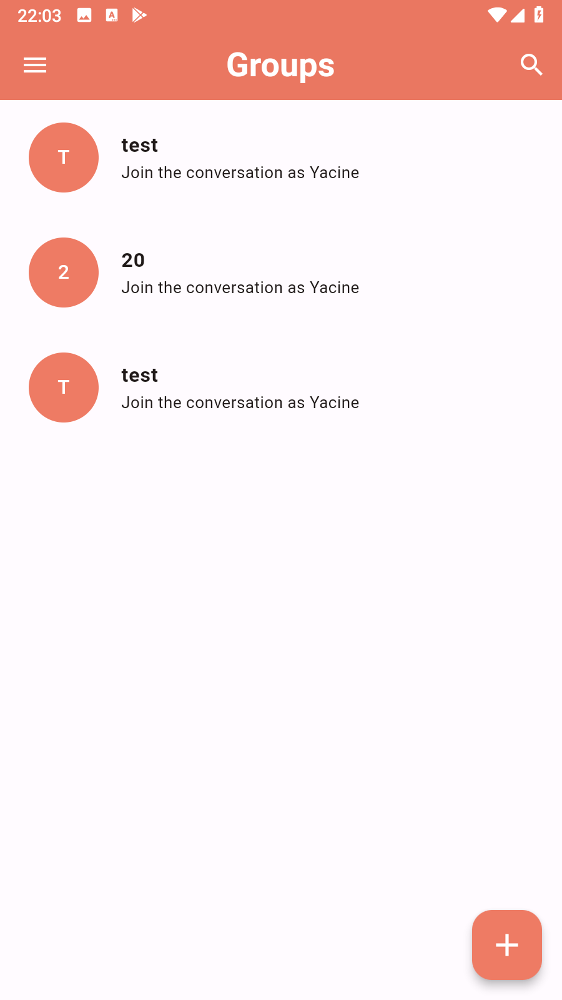

# Groupie

## Overview

This Flutter Chat App is a group-based messaging application that allows users to chat with each other within specific groups. Users can create or join existing groups and communicate with other members of the same group in real-time.

The app uses Firebase Firestore as the backend for storing and retrieving chat messages and group information. It utilizes Firebase Authentication for user authentication, ensuring secure access to the chat functionality.

## Features

- User Authentication:
  - Sign up and login with email and password.
  - Password reset functionality.

- Group Management:
  - Create new chat groups with a unique name and description.
  - Search for existing groups to join.

- Real-time Chat:
  - Send and receive messages within a group in real-time.
  - See online/offline status of group members.

- User Profile:
  - View and update user profile information.
  - Set a profile picture.

## Screenshots

## Dependencies

The app uses the following dependencies:

cupertino_icons: ^1.0.2
  firebase_core: ^2.14.0
  firebase_auth: ^4.6.3
  cloud_firestore: ^4.8.2
  shared_preferences: ^2.2.0

## Contributing

Contributions are welcome! If you find any bugs or want to add new features, please create an issue or submit a pull request.

## License

This project is licensed under the [MIT License](LICENSE).
